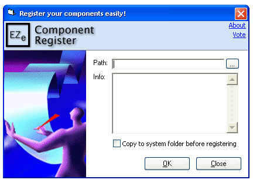

## EZe Component Register

### Description

The program will easily register your .ocx, .dll, .tlb, etc components quickly. Simply double click on the component and it's registered! Also has a few other fancy stuff in but I guarantee it will be useful to you!
 
### More Info
 

             |
---                |---
**Submitted On**   |2000-01-07 09:43:26
**By**             |[TonysComp](https://github.com/Planet-Source-Code/PSCIndex/blob/master/ByAuthor/tonyscomp.md)
**Level**          |Intermediate
**User Rating**    |5.0 (20 globes from 4 users)
**Compatibility**  |VB 4\.0 \(32\-bit\), VB 5\.0, VB 6\.0
**Category**       |[Custom Controls/ Forms/  Menus](https://github.com/Planet-Source-Code/PSCIndex/blob/master/ByCategory/custom-controls-forms-menus__1-4.md)
**World**          |[Visual Basic](https://github.com/Planet-Source-Code/PSCIndex/blob/master/ByWorld/visual-basic.md)
**Archive File**   |[EZe\_Compon3448611112001\.zip](https://github.com/Planet-Source-Code/tonyscomp-eze-component-register__1-28802/archive/master.zip)

